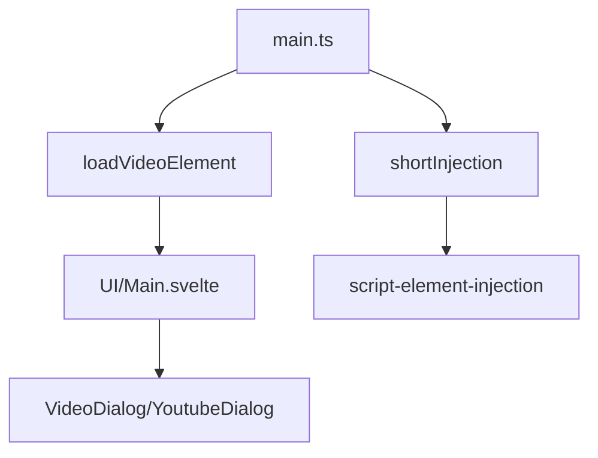

# ארכיטקטורת הפרויקט Gingim Booster

## מבנה הפרויקט 🏗️

```
src/
├── UI/
│   ├── components/
│   │   ├── LoadingSpinner.svelte    # קומפוננטת טעינה
│   │   ├── Modal.svelte            # חלון מודאלי גנרי
│   │   ├── VideoDialog.svelte      # דיאלוג להצגת וידאו רגיל
│   │   └── YoutubeDialog.svelte    # דיאלוג להצגת וידאו מיוטיוב
│   ├── Main.svelte                 # קומפוננטה ראשית
│   └── global-state.svelte.ts      # ניהול מצב גלובלי
│
├── lib/
│   ├── event-bus.ts               # מערכת אירועים מרכזית
│   ├── game-config.ts            # טיפוסים והגדרות משחק
│   ├── get-game-config.ts        # שליפת קונפיגורציית משחק
│   ├── script-element-injection.ts # הזרקת סקריפטים
│   └── wrap-fun-by-path.ts       # עטיפת פונקציות
│
└── main.ts                       # נקודת כניסה ראשית
```

## זרימת מידע ותהליכים 🔄

### תהליך עיקרי


### ניהול מצב ואירועים
- **EventBus**: מערכת אירועים מרכזית לתקשורת בין קומפוננטות
- **global-state**: ניהול מצב גלובלי של האפליקציה

## קומפוננטות עיקריות 🧩

### Main.svelte
- קומפוננטה ראשית המנהלת את ממשק המשתמש
- מטפלת בהצגת והסתרת תוכן
- מתקשרת עם מערכת האירועים

### VideoDialog/YoutubeDialog
- מציגים תוכן וידאו בחלון מודאלי
- תומכים בהפעלה/עצירה אוטומטית
- מנהלים את מחזור החיים של הווידאו

## מערכות ליבה 🛠️

### מערכת הזרקת קוד
```typescript
interface FunctionConfig {
    name: string,
    path: string
}

// הזרקת קוד למשחק
InjectCodeIntoIframe(scriptUrl: string)
wrapFunctionByPath(path: string, beforeCallback, afterCallback)
```

### ניהול קונפיגורציה
```typescript
interface gameConfig {
    gameName: string,
    triggerFunc: FunctionConfig,
    delay: number,
    gameUrlPath: string
}
```

## תהליכים עיקריים 📈

1. **טעינת המערכת**:
   ```
   main.ts → loadVideoElement → UI initialization → Event listeners setup
   ```

2. **הפעלת וידאו**:
   ```
   trigger → VideoDialog → play/pause → event-bus notification
   ```

3. **הזרקת קוד**:
   ```
   script-element-injection → wrap-fun-by-path → game interaction
   ```

## API פנימי 📡

### event-bus
```typescript
eventBus.emit('videoStart', ...args)
eventBus.on('videoEnd', callback)
```

### VideoController
```typescript
interface VideoController {
    play: () => void
    pause: () => void
}
```

## תצורה והגדרות ⚙️

```typescript
interface Config {
    videoDisplayTimeInMS: number
    videoUrl: string
    mode: string
}
```

## הערות נוספות 📝

1. המערכת בנויה באופן מודולרי עם הפרדה ברורה בין:
   - ממשק משתמש (UI components)
   - לוגיקת הזרקת קוד (script injection)
   - ניהול מצב (event-bus & global state)

2. שימוש ב-TypeScript מספק אבטחת טיפוסים ו-IDE support טוב

3. הקוד מאורגן בצורה היררכית עם הפרדה ברורה בין האחריות של כל מודול